# Socially - Social Media Influencer Management Platform (Expo)


## Overview

Socially is a comprehensive social media management platform built with Expo, designed for content creators and influencers. It streamlines content creation, management, analytics, and business operations in one unified solution, supporting Android, iOS, and Web from a single codebase.

## Features

- **Unified Content Management**
  - Single dashboard for all social media platforms
  - Automated content scheduling
  - Cross-platform content adaptation

- **Content Creation**
  - Media upload and editing tools
  - Caption creation with hashtag suggestions
  - Platform-specific publishing options
  - Drafts and scheduling

- **Analytics Dashboard**
  - Performance metrics visualization
  - Audience insights (demographics, geography, interests)
  - Growth and engagement analysis

- **Business Management**
  - Brand deal tracking
  - Financial overview
  - Reporting tools

- **Authentication & Profile**
  - Secure login and registration
  - Profile management
  - Statistics display (followers, posts, following)


## Tech Stack

- Expo (React Native framework)
- TypeScript
- Supabase (backend)
- Expo Router
- Expo modules: Camera, Image Picker, Secure Store, Font, Haptics, Linear Gradient, Web Browser, and more


## Getting Started

1. Clone the repository.
2. Install dependencies:
   ```sh
   npm install
   ```
3. Start the Expo development server:
   ```sh
   npx expo start
   ```
4. Run on your target platform:
   - Android: `npm run android` or use QR code in Expo Go app
   - iOS: `npm run ios` or use QR code in Expo Go app
   - Web: `npm run web`

For more Expo CLI commands, see the [Expo documentation](https://docs.expo.dev/).


## Project Structure

- `app/` - Main app screens and layouts (Expo Router)
- `components/` - Reusable UI components
- `constants/` - Configuration files
- `hooks/` - Custom hooks
- `lib/` - Supabase integration
- `providers/` - Context providers
- `android/` - Native Android project files
- `assets/` - Fonts and images


## Implementation Status

See `PROJECT_STATUS.md` for completed and in-progress features.


## Screenshots

Below are mobile screenshots of the Socially app:

<p align="center">
  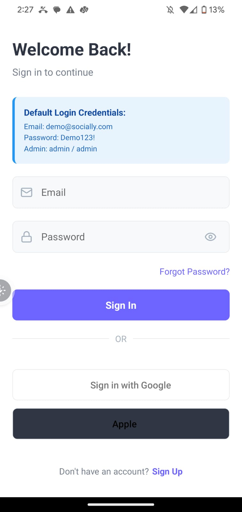
  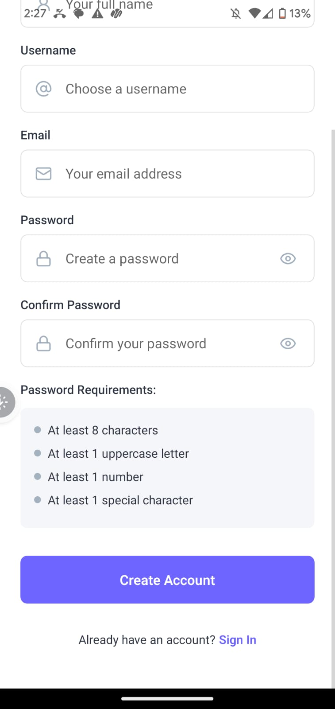
  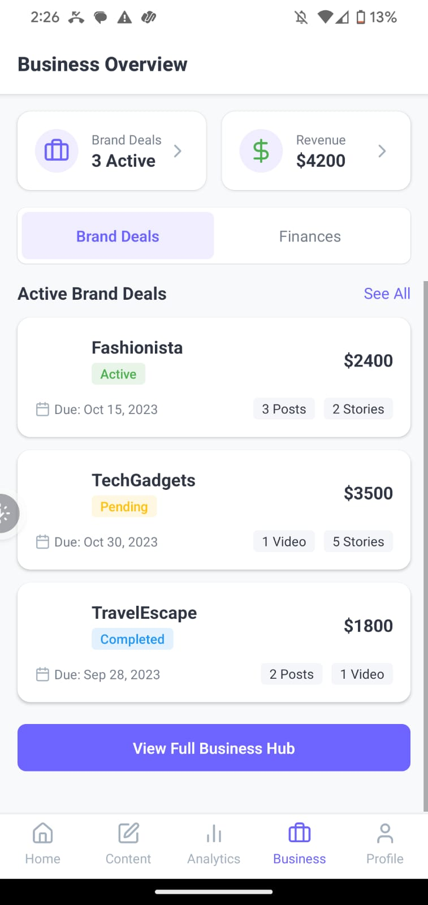
  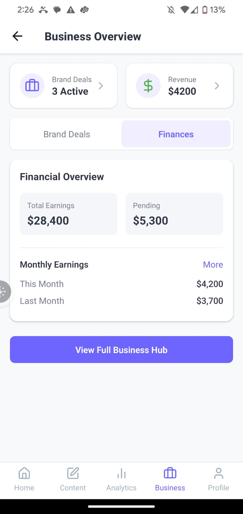
  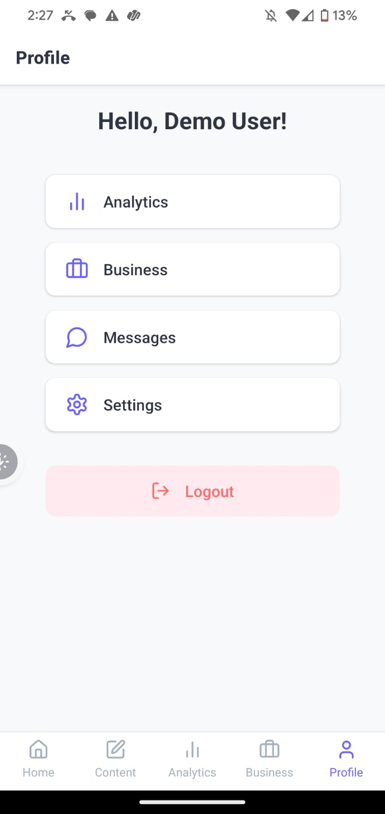
  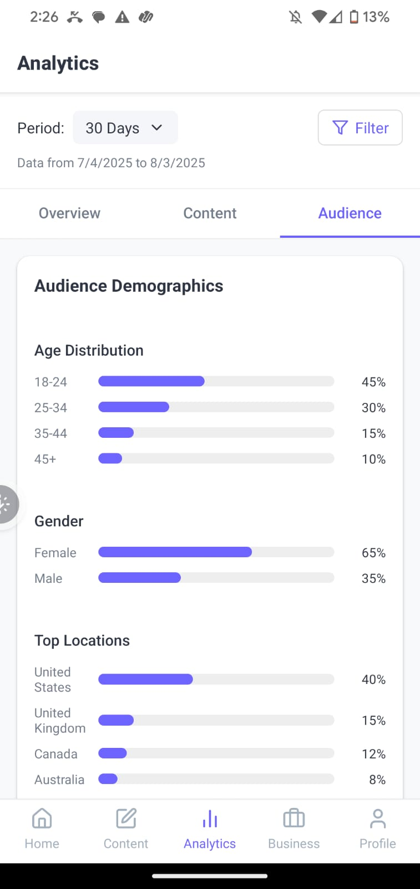
  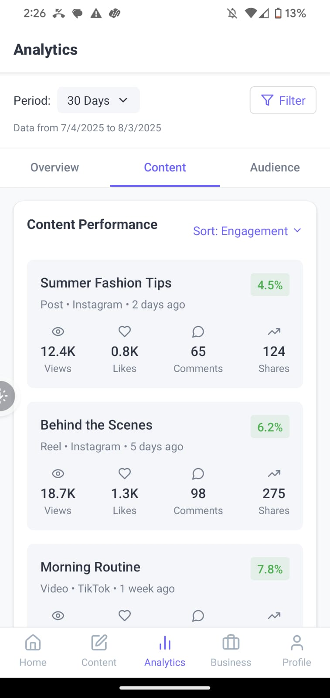
  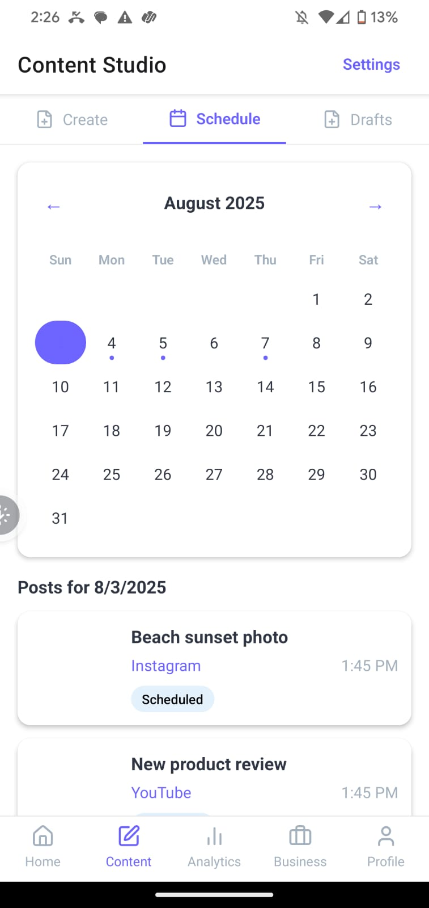
  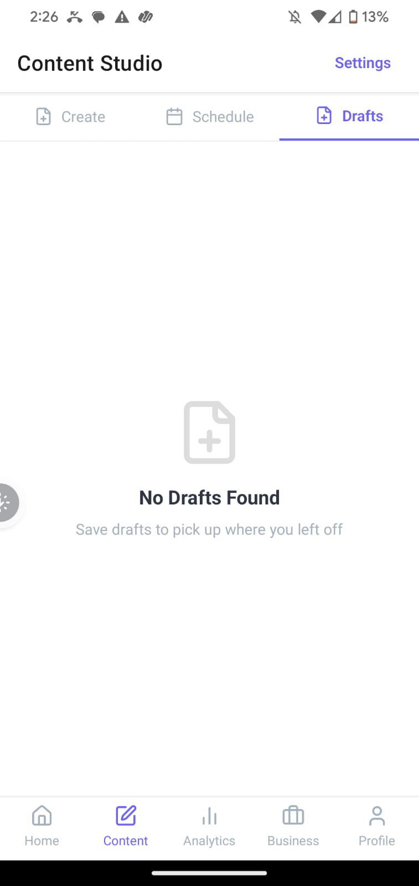
  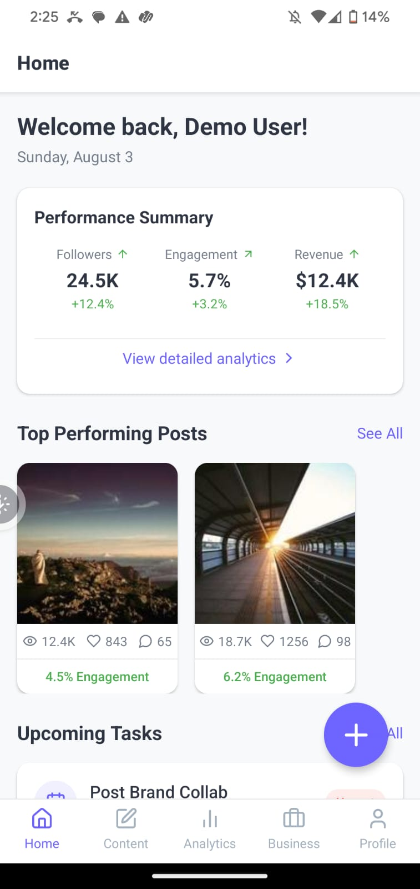
  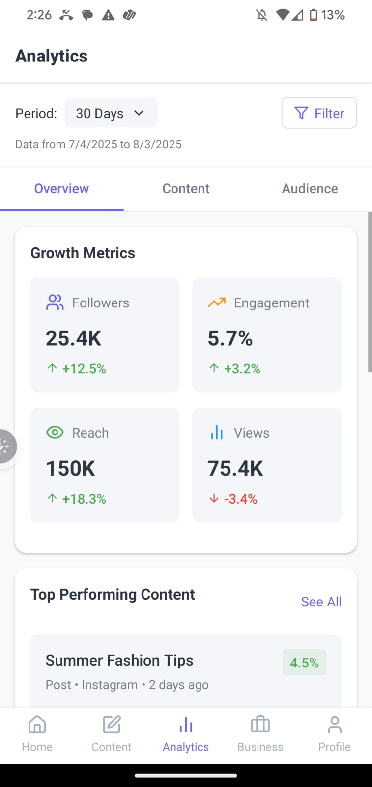
  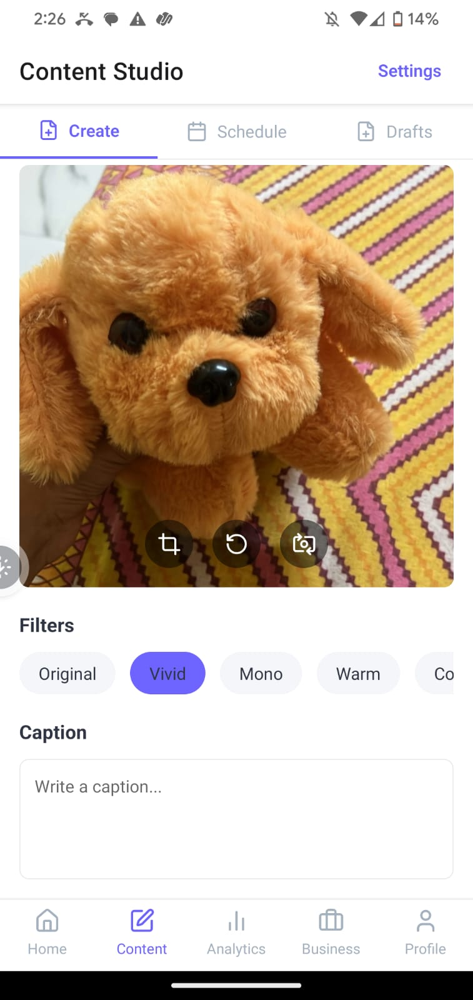
  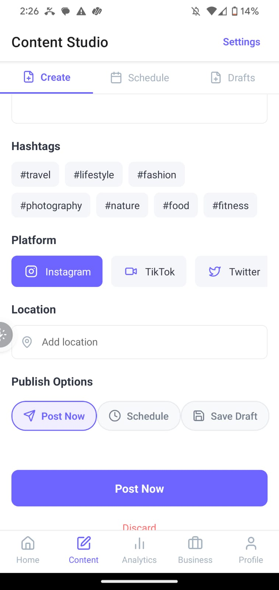
  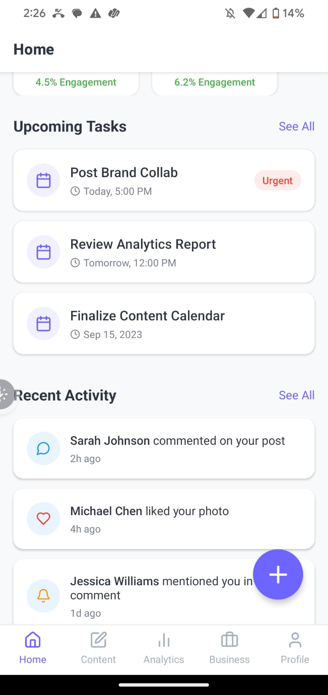
</p>


## License

Proprietary. All rights reserved.
